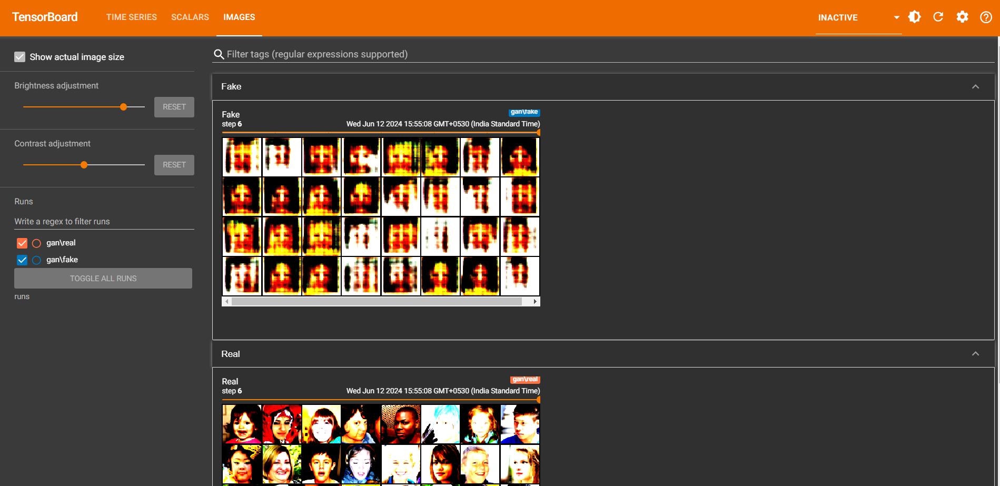

# DCGAN Implementation

This repository contains a PyTorch implementation of a Deep Convolutional Generative Adversarial Network (DCGAN) for image generation.

## Overview

The DCGAN is a type of GAN that uses convolutional and transposed convolutional layers in the discriminator and generator networks, respectively. This architecture has been shown to be effective for generating high-quality images.

The code in this repository trains a DCGAN on the CelebA dataset, which contains images of celebrity faces. The trained generator network can then be used to generate new, realistic-looking face images.

## Model Architecture
The model architecture consists of a generator and a discriminator network. The generator takes a noise vector as input and generates a realistic-looking image, while the discriminator tries to distinguish between real and generated images.

The specific architecture of the generator and discriminator can be found in the `Generator` and `Discriminator` classes defined in the `DCGAN.ipynb` file.

## Results
After training the DCGAN model, you can generate new face images using the trained generator. The generated images will be saved in the `logs/fake` directory, and you can visualize them using TensorBoard.

Here is an example of generated face images:



## Requirements

```python
- PyTorch
- Torchvision
- Numpy
- Matplotlib
- Jupyter Notebook (or any Python environment


